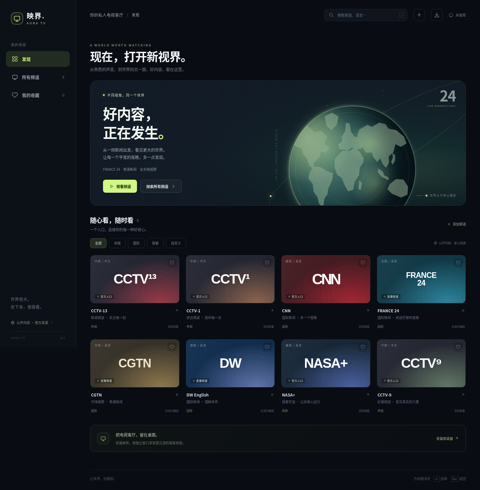

# 映界 · AURA TV

轻量的 Windows 桌面电视客厅，采用 Apple TV 风格的大卡片、沉浸式播放和键盘导航。基于 TypeScript、Vite 与按需加载的 hls.js；无需账号、数据库或 Electron。



## Windows 使用

1. 安装 [Node.js 24 LTS](https://nodejs.org/)，下载 [v0.1.1 Windows 启动包](https://github.com/gzpagg/-/releases/download/v0.1.1/aura-tv-windows.zip) 并解压。
2. 双击 `start-windows.cmd`。首次运行会安装依赖、构建应用，并打开浏览器。使用期间保留终端窗口。
3. 用 Edge / Chrome 打开后，可通过地址栏安装按钮，或菜单「应用 → 将此站点作为应用安装」，获得独立桌面窗口。

这是可安装的 PWA，不是原生 `.exe`。若部署到 HTTPS 静态站点，使用者不需要 Node.js 或本地服务；所有文件在 `dist/`。本地构建默认站点根路径，`APP_BASE_PATH=/-/` 支持 GitHub Pages 项目路径。应用壳可缓存，直播需要网络。发布流程和当前状态见 [部署说明](docs/DEPLOYMENT.md)。

## 已实现

- 中文深色界面、频道分类与搜索、收藏本地保存。
- HLS 自适应播放、按实际片源清晰度切换、全屏、连接失败提示与官方入口。
- 添加、删除自己有权观看的公开 `.m3u8` / `.mp4` / `.webm` 地址；源站需要允许浏览器跨域播放。
- 批量导入 M3U、TXT 和 TVBox 静态直播列表：链接、粘贴或文件读取，预览选择、去重、分组保存与搜索。
- 方向键移动频道焦点，Enter 打开，Esc 关闭，`/` 搜索，播放时 `F` 全屏。
- Edge / Chrome 桌面安装、响应式布局、无外部字体或图片依赖。

## 频道与内容边界

| 频道 | 观看方式 |
| --- | --- |
| CCTV-1、CCTV-9、CCTV-13 | 官方观看入口 |
| CNN | 官方观看入口；完整直播可能需要订阅或电视服务商登录，且受地区限制 |
| France 24 English、CGTN、DW English | 尝试 GitHub 公开目录收录的直播地址，失败时提供官网入口 |
| NASA+ | 官方观看入口，内容和直播安排以官网为准 |

高清取决于源站提供的清晰度，应用不会把低清标为高清。GitHub 公开目录不代表内容授权；应用不代理或重新分发媒体、不绕过付费和地区限制。

**验证范围：**官方页面及公网直播在当前云环境被网络代理拦截，尚未完成实播验证。本地 HLS 测试用于验证播放器功能，不代表上述公网频道可用。完整来源和验证记录见 [docs/SOURCES.md](docs/SOURCES.md)。

构建及测试结果详见 [验证记录](docs/VALIDATION.md)。Windows 启动脚本已提供，尚未在真实 Windows 系统上执行。

右上角「＋」→「批量导入频道」可以读取公开频道列表。关于用户提供的 qist/tvbox 等四个地址、CGTN 多语种候选与导入限制，见 [TVBox 核验与使用说明](docs/TVBOX.md)。

## 开发与验证

```bash
npm ci
npm run dev
npm run build
npm test
```

浏览器功能测试需要 ffmpeg 和支持 H.264/AAC 的浏览器。GitHub Actions 使用正式版 Chrome；部分开源 Chromium 构建缺少对应编解码器。Linux 示例：

```bash
# 使用已安装的 Google Chrome，也可替换为支持 H.264/AAC 的浏览器路径
PLAYWRIGHT_CHROMIUM_EXECUTABLE=/usr/bin/google-chrome node scripts/verify-browser.mjs
PLAYWRIGHT_CHROMIUM_EXECUTABLE=/usr/bin/google-chrome npm run test:e2e
```

生产验证与打包：

```bash
npm run build
node scripts/verify-pages.mjs
python3 scripts/package-release.py
```

`release/` 包含 Windows 启动包和 SHA-256 校验文件。打包不包含 node_modules、环境变量文件或测试媒体。第三方组件声明随静态站点发布于 `licenses/`，也保留在 `docs/licenses/`。

测试通过本地产生的音视频 HLS 分片验证解码、播放进度、清晰度切换和关闭清理；不依赖公网电视信号。测试输出与媒体样本在被忽略的目录中。`npm run build` 生成可以静态部署的 `dist/`。

云环境工作目录为 `/workspace/-`。若默认 npm 缓存不可写，使用 `npm ci --cache /tmp/aura-npm-cache --no-audit --no-fund`。云任务已隔离，直接使用现有仓库，无需额外 Git worktree。

## 隐私

频道收藏与自定义链接仅存储在当前浏览器的 `localStorage`，不上传。连接频道时，浏览器直接请求对应媒体提供方；官方入口在新标签页打开。不要在自定义地址中保存私人凭据；带签名的链接可能过期。

## 结构

```text
src/catalog.ts       频道与来源信息
src/domain.ts        输入验证、搜索和本地存储
src/playlist.ts      M3U/TXT/TVBox 静态列表解析
src/importer.ts      列表读取、预览和选择导入
src/player.ts        HLS/视频生命周期与画质选择
src/main.ts          界面与交互
src/styles.css       视觉与响应式样式
public/              安装清单、图标和应用壳缓存
tests/               浏览器集成测试
```
