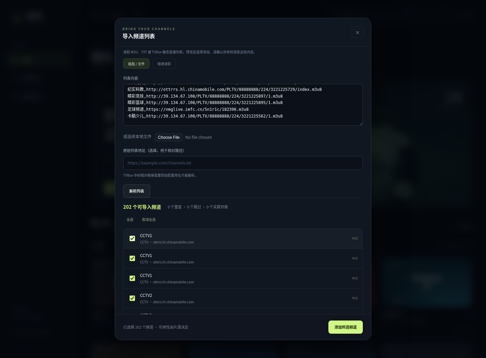

# TVBox 来源核验与列表导入

2026-10-06，根据用户提供的四个地址进行只读检查。没有执行外部插件或把未验证的媒体地址加入内置频道。

## 四个地址的结果

| 地址 | 实际观测 | 当前结论 |
| --- | --- | --- |
| [qist/tvbox](https://github.com/qist/tvbox) | README、代表性 JSON 和 TXT 文件可读取 | 有可复用的静态直播列表结构；整个仓库不是一份可直接播放的频道列表 |
| `https://9280.kstore.vip/newwex.json` | 云代理 CONNECT 返回 403 | 未取得正文，无法判断配置或片源 |
| `https://tv.xn--yhqu5zs87a.top` | 云代理 CONNECT 返回 403 | 未取得正文，无法判断内容 |
| `http://xhztv.top/xhz` | 403，响应正文 `Domain forbidden` | 当前网络策略拒绝；无法判断内容，且 HTTP 不能直接从 HTTPS 应用读取 |

已将上述三个受限域名和下列五个 CGTN 域名追加到云环境网络草稿，保留此前域名与包管理器预设。草稿保存不代表网络已生效或已经发布。需要设置生效后重试；没有使用镜像绕过网络策略。

## qist/tvbox 中实际发现的内容

- [list.txt](https://github.com/qist/tvbox/blob/master/list.txt)：`分组,#genre#`、`频道,URL` 格式。当前读取到 202 条 HLS 候选，分成 CCTV、卫视、精品三组；196 条 HTTP、6 条 HTTPS，含 55 个同名多线路组。解析成功不意味着信号可用、高清或具备转播授权。
- [0821.json](https://github.com/qist/tvbox/blob/master/0821.json)：16 组 `lives` 入口，包括 `./list.txt` 和 `./radio.txt`，同时含点播站点和插件配置。新导入器识别 12 个关联列表，对 4 个有 UA 要求的入口明确跳过。
- [jsm.json](https://github.com/qist/tvbox/blob/master/jsm.json)：3 组直播入口均指定 `okhttp` UA；当前导入器跳过并提示浏览器兼容性限制，不把它们冒充成已支持的普通链接。
- [tvboxtv.txt](https://github.com/qist/tvbox/blob/master/tvboxtv.txt)：读取到 1,391 个 URL，其中 394 个 IPv6 地址；有运营商直播、点播和 MV，不能整体视为公网直播库。
- [radio.txt](https://github.com/qist/tvbox/blob/master/radio.txt)：音频与视频混合；其中 `CNN News` 是电台条目，不是 CNN 电视直播。
- `0707.json` 是多仓配置聚合，不是电视频道列表；没有继续沿其无关入口抓取。

没有在所检查的电视直播列表中找到可确认的 CNN 电视或 DW 条目。央视条目主要是运营商 HTTP/IPv6 转播地址，尚未确认实播、官方授权或公网可用性。

## 找到的 CGTN 官方域名候选

| 频道 | 播放地址 |
| --- | --- |
| CGTN 纪录 | `https://livedoc.cgtn.com/500d/prog_index.m3u8` |
| CGTN 俄语 | `https://liveru.cgtn.com/1000r/prog_index.m3u8` |
| CGTN 法语 | `https://livefr.cgtn.com/1000f/prog_index.m3u8` |
| CGTN 西语 | `https://livees.cgtn.com/1000e/prog_index.m3u8` |
| CGTN 阿语 | `https://livear.cgtn.com/1000a/prog_index.m3u8` |

五个地址的小流量 GET 均在代理 CONNECT 阶段返回 403，未到达源站。清单、CORS、分片、分辨率和认证要求未验证，因此没有默认加入内置频道。

## 已新增：频道列表导入

打开右上角「＋」→「批量导入频道」：

1. 粘贴列表内容、选择本地文件，或切到「链接读取」。
2. 点击解析，查看可导入数、重复项、跳过原因和频道分组。
3. 勾选需要的频道，再点击「添加所选频道」。它们出现在「自定义」，分组会保存并可以搜索。

可试用的**列表地址**（不是单条播放地址）：

```text
https://raw.githubusercontent.com/qist/tvbox/master/list.txt
https://raw.githubusercontent.com/qist/tvbox/master/0821.json
```

当前云机器的 Chromium 直接读取 GitHub Raw 时另有证书信任错误；Python 的正常 TLS 读取成功。真实内容已通过文件/粘贴方式验证，浏览器公网链接读取尚未验证。没有关闭 TLS 检查；如果遇到读取失败，可用本地文件或粘贴导入。

TVBox 配置只提取静态直播数据。关联列表会先展示，用户点击后才读取；粘贴/上传的配置含 `./list.txt` 等相对路径时，需要填写原始配置 URL。GitHub 的具体文件 `blob` 链接会转换为 Raw 地址；仓库首页不能直接导入。



支持与边界：

- M3U 的 `#EXTINF` 名称/分组、TXT 的 `#genre#` 分组、TVBox 的静态 `lives` / `channels` / `urls`。
- 只导入 HTTP(S) `.m3u8`、`.mp4`、`.webm` 媒体；不把 HLS 的媒体分片当成电视频道。
- 同名不同地址保留为多个条目，尚未实现同频道自动备用线路切换。
- 链接请求受源站 CORS 限制，失败时可以下载文件或粘贴内容。不会伪装 UA/Referer，也不会执行 JAR、JavaScript 解析接口或网盘授权。
- HTTPS 部署会跳过 HTTP 媒体地址；对上述 `list.txt` 实测为 6 条可导入、196 条跳过。Windows 本地 HTTP 服务下可以解析 HTTP 地址，但是否能播放仍取决于网络和源站。
- 每份列表限制 2 MiB、1,000 个可导入频道、100 个关联列表；大列表需拆分。
- XMLTV 节目单、同频道自动换源尚未实现。节目回看还要求源站本身支持。

GitHub 文件公开可读不等于所有节目免费授权。导入器仅处理用户选择的数据，不代理或分发媒体。
